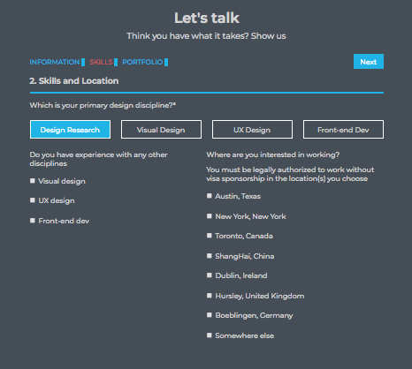

# Web form: Let's talk  

Web form: Let's talk with user can fill the personal information following template. Here is [ the live demo](https://trungh13.github.io/integrify-assignment4-webform/SkillsAndLocation) and the screenshot of application below in version.

## Version
v0.2 ReactJS [Source code in master-react branch](https://github.com/trungh13/integrify-assignment4-webform/tree/master)


* Redo the application with ReactJS/ CSS Modules/React Router v4 
* Passing props though React Router.
* Deploy it to [gh-pages branch](https://github.com/trungh13/integrify-assignment4-webform/tree/gh-pages) using [react-gh-pages](https://github.com/gitname/react-gh-pages)

v0.1 VanillaJS [Source code in master branch](https://github.com/trungh13/integrify-assignment4-webform/tree/master).


  
  * Form with input type text, number, checkbox, radio, textarea.
  * Validate by VanilaJS/HTML5 

## Getting Started

These instructions will get you a copy of the project up and running on your local machine for development and testing purposes. See deployment for notes on how to deploy the project on a live system.

### Prerequisites

**You’ll need to have Node >= 6 on your local development machine** (but it’s not required on the server). You can use [nvm](https://github.com/creationix/nvm#installation) (macOS/Linux) or [nvm-windows](https://github.com/coreybutler/nvm-windows#node-version-manager-nvm-for-windows) to easily switch Node versions between different projects.

### Installing

A step by step series of examples that tell you how to get a development env running

```
git clone https://github.com/trungh13/integrify-assignment4-webform.git

cd integrify-assignment4-webform

npm install
```
---
©2018 Trung Hoang. Visit me on <a href="https://github.com/trungh13/">Github :octocat:</a> 
